# Tech Trends Agent 🚀

**A robust, scalable AI-powered web service combining FastAPI, Pydantic-AI, and MCP servers**

[](https://www.python.org/downloads/)
[](https://fastapi.tiangolo.com/)
[](https://ai.pydantic.dev/)
[](https://www.docker.com/)

This project demonstrates how to build a production-ready AI-powered web service by combining three cutting-edge, open-source technologies:

1. **FastAPI** for high-performance asynchronous APIs
2. **Pydantic-AI** for type-safe, schema-driven agent construction
3. **Model Context Protocol (MCP)** servers as plug-and-play tools


A quick glance at the UI: type a question, choose sources (Hacker News and/or Web Search), then get ranked trend cards with scores, links, and an AI-written summary—so you can quickly see what's trending about any topic or technology.

## 🎯 What You'll Learn

- Advanced data modeling patterns with Pydantic
- Multi-agent AI systems with A2A communication
- MCP server integration for extensible AI tools
- Production-ready FastAPI deployment patterns with routers
- Docker containerization for AI services
- Type-safe AI agent development with a factory pattern
- Configuration for local LLMs like Ollama, LMStudio, and vLLM

## 🏗️ Architecture

The application is architected for clarity, scalability, and separation of concerns.

```mermaid
flowchart TD
    subgraph UI["🌐 Web UI + API Docs"]
        U["👤 User"] -->|HTTP| R["🚀 FastAPI Routers<br/>(app/routers)"]
    end

    subgraph CORE["🎯 Core Application"]
        R --> D["⚙️ Dependencies<br/>(app/dependencies)"]
        D --> AM["AgentManager"]
        AM --> AF["AgentFactory"]
        AF --> EA["🤖 EntryAgent Service"]
        AF --> SA["🤖 SpecialistAgent Service"]
    end

    subgraph A2A_LAYER [📡 Agent-to-Agent]
        EA <--> A2A["A2A Protocol"]
        SA <--> A2A
    end

    subgraph TOOLS["🔌 Tooling (via MCP)"]
        EA --> BS["🔍 Brave Search MCP"]
        EA --> HN["📰 Hacker News MCP"]
        SA --> GH["🐙 GitHub MCP (opt.)"]
    end

    classDef agent fill:#ffffff,color:#111827,stroke:#60a5fa,stroke-width:2px,rx:10,ry:10
    classDef svc fill:#f8fafc,color:#111827,stroke:#0288d1,stroke-width:2px,rx:10,ry:10
    classDef toolActive fill:#ffffff,color:#111827,stroke:#16a34a,stroke-width:2px,rx:10,ry:10

    class EA,SA agent
    class R,D,AM,AF,A2A svc
    class BS,HN,GH toolActive
```



## 🚀 Quick Start (Docker - Recommended)

### Prerequisites

- Docker and Docker Compose
- LLM API Key (e.g., from OpenAI) or a local LLM server (Ollama, etc.)
- GitHub token (optional, for enhanced GitHub features)

### 1. Clone and Setup

```bash
git clone <your-repo-url>
cd Tech_Trends_Agent
```

### 2. Configure Environment

```bash
# Copy environment template
cp env.example .env

# Edit .env with your API keys and configuration
vi .env  # or your preferred editor
```

### 3. Configuring the LLM Provider

This application supports multiple LLM backends. You can configure the provider and model using the following environment variables in your `.env` file:

- `LLM_PROVIDER`: The provider to use. Supported values are:
    - `openai` (default)
    - `ollama`
    - `lmstudio`
    - `vllm`
- `LLM_MODEL_NAME`: The name of the model to use (e.g., `gpt-4o`, `llama3`, `mistral`).
- `LLM_API_BASE_URL`: The base URL of the LLM provider's API. This is required for local models.
    - For **Ollama**: `http://localhost:11434/v1`
    - For **LMStudio**: `http://localhost:1234/v1`
    - For **vLLM**: The URL of your vLLM server's OpenAI-compatible endpoint.
- `LLM_API_KEY`: The API key for the provider. For local models that do not require an API key, this can be left empty.

**Example for Ollama:**
```env
LLM_PROVIDER=ollama
LLM_MODEL_NAME=llama3
LLM_API_BASE_URL=http://localhost:11434/v1
LLM_API_KEY=
```


### 3. Configuring the LLM Provider

This application supports multiple LLM backends. You can configure the provider and model using the following environment variables in your `.env` file:

- `LLM_PROVIDER`: The provider to use. Supported values are:
    - `openai` (default)
    - `ollama`
    - `lmstudio`
    - `vllm`
- `LLM_MODEL_NAME`: The name of the model to use (e.g., `gpt-4o`, `llama3`, `mistral`).
- `LLM_API_BASE_URL`: The base URL of the LLM provider's API. This is required for local models.
    - For **Ollama**: `http://localhost:11434/v1`
    - For **LMStudio**: `http://localhost:1234/v1`
    - For **vLLM**: The URL of your vLLM server's OpenAI-compatible endpoint.
- `LLM_API_KEY`: The API key for the provider. For local models that do not require an API key, this can be left empty.

**Example for Ollama:**
```env
LLM_PROVIDER=ollama
LLM_MODEL_NAME=llama3
LLM_API_BASE_URL=http://localhost:11434/v1
LLM_API_KEY=
```
### 4. Start the App
```bash
# Start with Docker (recommended)
./docker-start.sh

# Or manually with docker-compose
docker-compose up --build -d
```

### 5. Access the Application

- **Web UI**: http://localhost:8000/ui
- **Interactive API Documentation**: http://localhost:8000/docs
- **ReDoc Documentation**: http://localhost:8000/redoc
- **Health Check**: http://localhost:8000/health

### 6. Stop the App

```bash
# Stop the application
./docker-stop.sh
```

## 📁 Project Structure

```
HN_Github_Agents/
├── app/
│   ├── agents/                 # AI agent service classes
│   │   ├── factory.py
│   │   ├── entry_agent.py
│   │   └── specialist_agent.py
│   ├── routers/                # FastAPI routers
│   │   ├── analysis.py
│   │   ├── chat.py
│   │   └── system.py
│   ├── models/                 # Pydantic data models
│   │   ├── requests.py
│   │   ├── responses.py
│   │   └── schemas.py
│   ├── services/               # Business logic services
│   │   ├── a2a_service.py
│   │   └── agent_manager.py
│   ├── utils/                  # Utilities and configuration
│   │   ├── config.py
│   │   └── logging.py
│   ├── dependencies.py         # Shared dependencies
│   └── main.py                 # FastAPI application entrypoint
├── data/                       # Sample data
├── static/                     # Web interface files
├── tests/                      # Test suite
├── docker-compose.yml
├── Dockerfile
└── pyproject.toml
```

## 🎨 Advanced Features

### Extending Agent Capabilities

The new architecture uses an **AgentFactory** and **composition** instead of inheritance. To add a new agent service:

1.  **Create a new service class** in `app/agents/`. It does not need to inherit from any base class.
    ```python
    # app/agents/new_agent_service.py
    from pydantic_ai import Agent

    class NewAgentService:
        def __init__(self, agent: Agent):
            self.agent = agent

        async def process(self, input_data: str) -> str:
            return await self.agent.run(f"Process this: {input_data}")
    ```

2.  **Update the `AgentManager`** (`app/services/agent_manager.py`) to create and use your new service.
    ```python
    # In AgentManager.__init__
    self.new_agent_service: NewAgentService | None = None

    # In AgentManager.initialize
    new_agent_prompt = "You are a new agent."
    new_pydantic_agent = agent_factory.create_agent(new_agent_prompt)
    self.new_agent_service = NewAgentService(new_pydantic_agent)
    ```

3.  **Add a new router** in `app/routers/` to expose your service via an API endpoint.

This approach keeps agent creation and configuration centralized in the `AgentFactory` and makes services modular and easy to test.

## 🤝 Contributing

1. Fork the repository
2. Create a feature branch
3. Make your changes
4. Add tests for new functionality
5. Ensure all tests pass (`pytest`)
6. Submit a pull request
